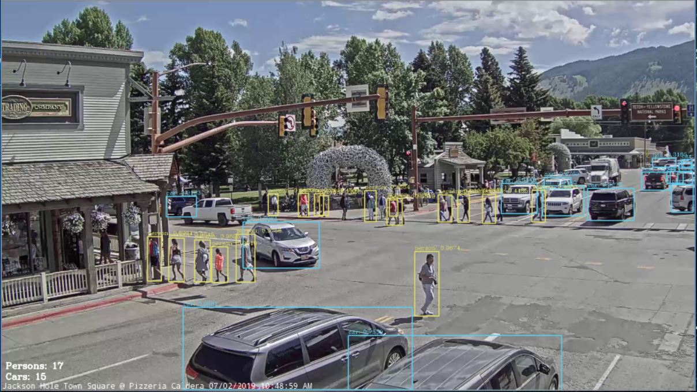
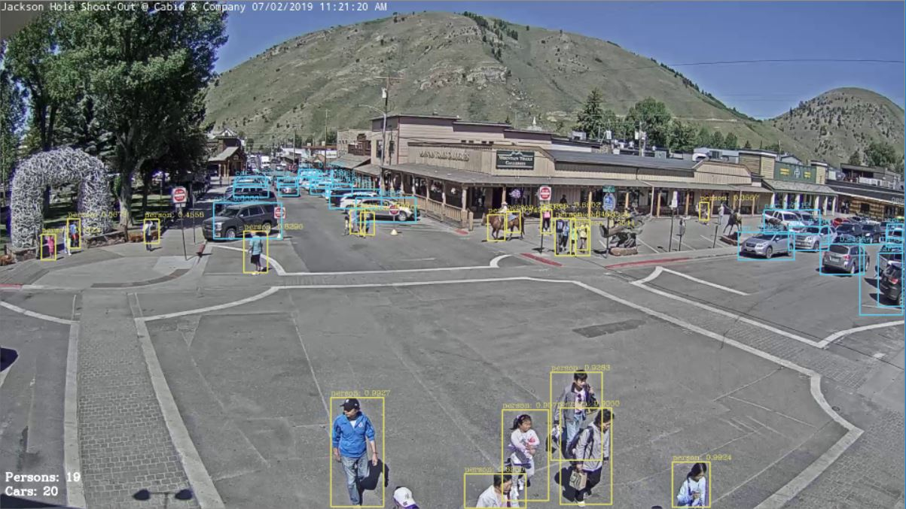

# OpenCV-yolo-stream
Real time object detection in (youtube) video stream:
* OpenCV with YOLOv3 detectionmethod (https://pjreddie.com/darknet/yolo/) 
* Streamlink (https://github.com/streamlink/streamlink)
  
 `$ pip install opencv-python`   

This repository can be use to do object detection in a video stream, then writing the the number of detected objects to an output file, every x seconds (default 5sec, dependent on performance). This is done by making use of the OpenCV library with the YOLOv3 detectionmethod. For an introduction to opencv and yolo refer to: https://www.pyimagesearch.com/2018/11/12/yolo-object-detection-with-opencv/. The sourcecode from this blog, by Adrian Rosebrock, is the starting point for this repository.

## YOLO Weights:
Download the YOLOv3 weights:
 `$ wget https://pjreddie.com/media/files/yolov3.weights`  
The weights have been trained on the COCO dataset (http://cocodataset.org)

## Example Output Jackson Hole Town Square Webcam
 Example youtube streams: Jackson Hole Wyoming USA Live Cams - SeeJH.com
* https://youtu.be/1EiC9bvVGnk
* https://youtu.be/RZWzyQuFxgE
 
Here I used:
* confidence level 0.30
* threshold level 0.55
 
Works reasonably well! However as expected, not every car and person is detected.
  

  

