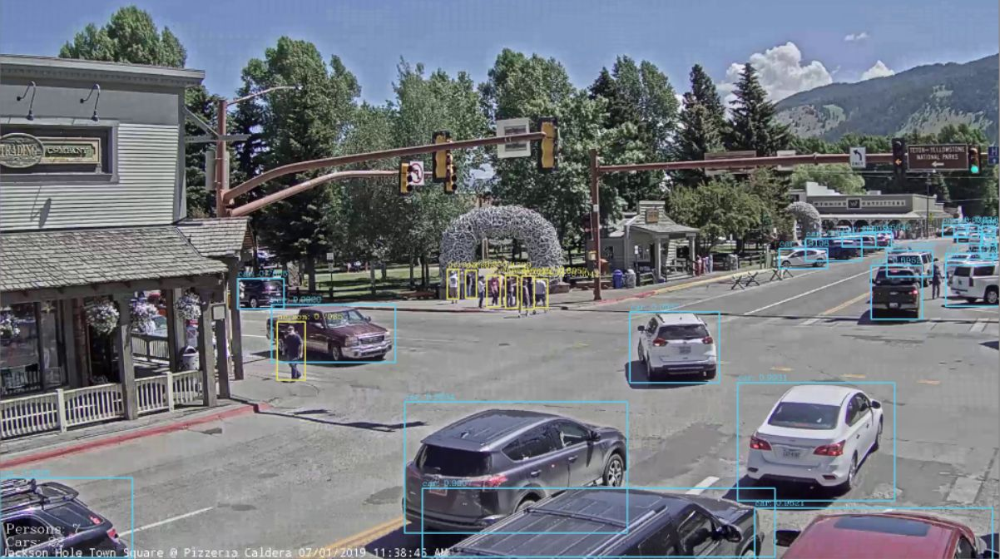

# OpenCV-yolo-stream
Real time object detection in (youtube) video stream:
* OpenCV with YOLOv3 detectionmethod (https://pjreddie.com/darknet/yolo/) 
* Streamlink (https://github.com/streamlink/streamlink)
  
`$  pip install opencv-python`

## Intro

The objective for this project is doing object detection in a videostream, then writing the the number of detected objects to an output file every 5 seconds. This is done by making use of the OpenCV framework with a YOLOv3 detectionmethod. For an introduction to opencv and yolo refer to: https://www.pyimagesearch.com/2018/11/12/yolo-object-detection-with-opencv/. The sourcecode from this blog, by Adrian Rosebrock, is the starting point for this repository.

## YOLO Weights & CFG:
Download the YOLOv3 weights:
 `$ wget https://pjreddie.com/media/files/yolov3.weights`

## COCO

## Output

